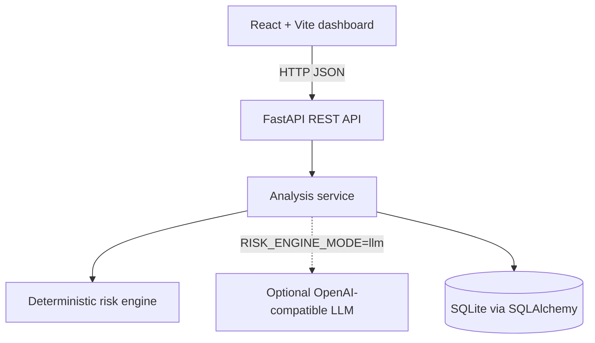

# Riskline — AI Risk Manager

Riskline is a small decision-support prototype for reviewing AI-assisted decisions and generated outputs. It looks for risk signals across seven categories, explains what it found, suggests mitigation steps, and stores previous analyses so they can be revisited.

## Overview

AI can make a workflow faster without making the resulting decision safe. A prompt or generated answer may expose personal data, create a security problem, introduce unfair treatment, make an unsupported factual claim, or trigger financial, compliance, or safety concerns. Those risks are often easy to miss when the only output is a model response or a single confidence number.

Riskline makes the first review step explicit. It is intentionally an MVP: the default engine is deterministic and inspectable, the UI shows the signals behind a result, and the application clearly separates triage from a final human decision.

## What It Does

The workflow is:

```text
User input
    ↓
Risk analysis service
    ↓
Seven category scores
    ↓
Overall score and risk level
    ↓
Signals, rationale, and mitigations
    ↓
SQLite analysis history
```

A user submits a scenario, prompt, decision, or AI-generated output. The backend validates the input, runs the selected analysis provider, returns a structured assessment, and saves the result. The React dashboard renders the assessment and allows earlier results to be opened again.

## Key Features

- Seven risk categories: privacy, security, financial/fraud, bias/fairness, hallucination/factuality, compliance, and safety.
- Transparent weighted scoring with a documented high-signal floor.
- Low, Medium, High, and Critical risk-level classification.
- Explainable signals and category rationales rather than an unexplained label.
- Prioritized mitigation recommendations with a suggested review owner.
- Deterministic offline/demo mode that works without an LLM API key.
- Optional LLM analysis through an OpenAI-compatible provider, with Pydantic validation and deterministic fallback.
- SQLite-backed analysis history.
- Input length validation, CORS configuration, and configurable rate limiting.
- REST endpoints documented through FastAPI’s generated OpenAPI UI.
- Responsive React/Vite dashboard with built-in demo scenarios.
- Backend unit tests for the deterministic engine and important score behavior.

## Risk Categories

| Category | What the current MVP looks for |
|---|---|
| Privacy | Personal or sensitive data, data collection, sharing, tracking, or exposure. |
| Security | Credentials, bypasses, offensive actions, privileged access, or production-system risk. |
| Financial / fraud | Fraud, payment abuse, unauthorized transfers, financial decisions, or money movement. |
| Bias / fairness | Protected attributes and decisions that rank, screen, exclude, hire, or reject people. |
| Hallucination / factuality | Medical, legal, financial, or other factual claims that need evidence or verification. |
| Compliance | Regulated data or obligations, consent, retention, review, or audit-trail concerns. |
| Safety | Physical harm, self-harm, weapons, dangerous instructions, or safety-sensitive contexts. |

The deterministic engine uses a deliberately small keyword-and-rule set. A matched rule contributes to one category, and each category is capped at 100. The rules are meant to be easy to read and extend, not to represent a complete risk taxonomy.

## How Risk Scoring Works

The category weights are defined in `backend/app/risk_engine/deterministic.py`:

| Category | Weight |
|---|---:|
| Privacy | 16% |
| Security | 16% |
| Financial / fraud | 16% |
| Bias / fairness | 14% |
| Hallucination / factuality | 14% |
| Compliance | 12% |
| Safety | 12% |
| **Total** | **100%** |

For each category, matching rules add a documented contribution. Contributions are capped at 100. The base score is the rounded weighted sum. The final score also applies a high-signal floor so that a severe signal in one category is not hidden by unrelated zeroes:

```text
weighted_score = round(sum(category_score × category_weight))
overall_score = max(weighted_score, round(0.75 × highest_category_score))
```

Risk levels use these thresholds:

| Score | Level |
|---:|---|
| 0–24 | Low |
| 25–49 | Medium |
| 50–74 | High |
| 75–100 | Critical |

The score is a triage heuristic. It is not calibrated against a labelled production dataset and should not be interpreted as a probability of harm.

## Architecture



The frontend calls the API through `frontend/src/services/api.js`. FastAPI routes live in `backend/app/api/routes.py`. The provider selection and fallback behavior are in `backend/app/services/analyzer.py`. The deterministic rules and score aggregation are in `backend/app/risk_engine/deterministic.py`. Pydantic models in `backend/app/schemas/risk.py` define the request and response contract.

## Tech Stack

| Area | Technology |
|---|---|
| Frontend | React, Vite, JavaScript, CSS, Lucide React icons |
| Backend | Python, FastAPI, Uvicorn |
| Database | SQLite with SQLAlchemy 2 |
| Validation | Pydantic v2 and FastAPI request validation |
| Testing | Pytest |
| Containerization | Dockerfile and Docker Compose configuration |
| AI/LLM integration | Optional OpenAI-compatible chat completion provider with structured JSON validation |

## Project Structure

```text
ai-risk-manager/
├── backend/
│   ├── app/
│   │   ├── api/routes.py
│   │   ├── database/core.py
│   │   ├── models/__init__.py
│   │   ├── models/analysis.py
│   │   ├── risk_engine/deterministic.py
│   │   ├── schemas/risk.py
│   │   ├── services/analyzer.py
│   │   ├── config.py
│   │   └── main.py
│   ├── tests/test_risk_engine.py
│   ├── Dockerfile
│   └── requirements.txt
├── frontend/
│   ├── src/
│   │   ├── services/api.js
│   │   ├── App.jsx
│   │   ├── main.jsx
│   │   └── styles.css
│   ├── index.html
│   ├── package.json
│   └── package-lock.json
├── .env.example
├── .gitignore
├── docker-compose.yml
├── README.md
└── SUBMISSION_GUIDE.md
```

## Getting Started

### Prerequisites

Install Python 3.11 or newer and Node.js 18 or newer. Docker is optional. The default demo engine does not require an LLM account or API key.

### Backend — Windows PowerShell

From the repository root:

```powershell
Copy-Item .env.example backend\.env
Set-Location .\backend
py -3 -m venv .venv
.\.venv\Scripts\Activate.ps1
python -m pip install -r requirements.txt
uvicorn app.main:app --reload --port 8000
```

If PowerShell blocks script activation, run the backend without activating the environment after installing into it, or change the execution policy for your user according to your local Python setup.

### Backend — Linux/macOS

From the repository root:

```bash
cp .env.example backend/.env
cd backend
python3 -m venv .venv
source .venv/bin/activate
python -m pip install -r requirements.txt
uvicorn app.main:app --reload --port 8000
```

The API is available at `http://localhost:8000`. FastAPI’s interactive documentation is at `http://localhost:8000/docs`.

### Frontend — Windows PowerShell, Linux, or macOS

Open a second terminal at the repository root:

```bash
cd frontend
npm install
npm run dev
```

On Windows PowerShell, the equivalent navigation is:

```powershell
Set-Location .\frontend
npm install
npm run dev
```

Open `http://localhost:5173`. The frontend defaults to `http://localhost:8000/api`. To use a different backend URL, create `frontend/.env` with:

```text
VITE_API_URL=http://localhost:8000/api
```

### Environment Variables

`.env.example` contains safe placeholders only. Copy it to `backend/.env` for local backend configuration; do not commit the copied file. Vite reads `VITE_API_URL` from the frontend environment when the frontend starts.

| Variable | Default | Purpose |
|---|---|---|
| `DATABASE_URL` | `sqlite:///./risk_manager.db` | SQLAlchemy database URL. |
| `RISK_ENGINE_MODE` | `demo` | `demo` for deterministic mode or `llm` for the optional provider. |
| `OPENAI_API_KEY` | empty | Optional provider credential. Never hardcode or commit it. |
| `OPENAI_MODEL` | `gpt-4o-mini` | Optional chat-completion model name. |
| `OPENAI_BASE_URL` | empty | Optional OpenAI-compatible API base URL. |
| `CORS_ORIGINS` | `http://localhost:5173` | Comma-separated frontend origin allow-list. |
| `MAX_INPUT_LENGTH` | `10000` | Configuration value documenting the intended input limit. The request schema enforces the current 10,000-character limit. |
| `RATE_LIMIT_PER_MINUTE` | `30` | Default requests per minute per client address. |
| `DEFAULT_USER_ID` | `demo-user` | Local demo history partition. |
| `VITE_API_URL` | `http://localhost:8000/api` | Frontend API base URL. |

### Running with Docker

The repository includes a `Dockerfile` for the backend and a `docker-compose.yml` that starts both services:

```bash
docker compose up --build
```

Then open `http://localhost:5173` and `http://localhost:8000/docs`. Docker was not available in the development sandbox used to prepare this repository, so the Docker path should be treated as a provided configuration and checked in the target environment before relying on it.

## API

| Method | Endpoint | Purpose |
|---|---|---|
| `GET` | `/api/health` | Returns service status, engine mode, and version. |
| `GET` | `/api/demos` | Returns the built-in demonstration scenarios. |
| `POST` | `/api/analyses` | Validates, analyzes, stores, and returns a new assessment. |
| `GET` | `/api/analyses?limit=20` | Returns recent history entries for the demo user. |
| `GET` | `/api/analyses/{analysis_id}` | Returns one stored assessment by ID. |

Example request:

```bash
curl -X POST http://localhost:8000/api/analyses \
  -H "Content-Type: application/json" \
  -d '{"input_text":"An AI assistant recommends denying a loan applicant because of their age and religion without evidence."}'
```

The response contains the overall score, risk level, summary, category scores and rationales, mitigation actions, assumptions, and the engine used for the assessment.

## Examples

The dashboard includes four scenarios that can be loaded without typing:

1. **Loan approval assistant:** a recommendation uses age, religion, and neighborhood without evidence. This exercises the bias/fairness rules and human-review mitigation.
2. **Suspicious refund decision:** an automated refund touches a bank account and possible chargeback abuse. This exercises financial/fraud and control-related signals.
3. **Medical answer:** an AI diagnosis uses incomplete records and recommends an unsafe dosage. This exercises factuality and safety signals.
4. **Low-risk summary:** a neutral summary of a public announcement. This demonstrates that the demo engine can return a low-signal result when none of its rules match.

These are synthetic examples. Do not paste real personal, financial, medical, authentication, or confidential company data into the local demo.

## Testing

Run the backend tests from the repository root:

```bash
PYTHONPATH=backend pytest -q backend/tests
```

On Windows PowerShell:

```powershell
$env:PYTHONPATH = "backend"
pytest -q backend\tests
```

The current test suite covers low-risk behavior, multi-category detection, category score boundaries, mitigation output, and a high-signal security scenario. The verified local result is **3 passed**. The frontend production bundle can be checked with:

```bash
cd frontend
npm run build
```

## Design Decisions

**Deterministic scoring is the default.** It makes the demo reproducible, keeps the project usable without credentials, and lets a reviewer inspect why a category was triggered. It is intentionally a baseline, not a substitute for a trained risk model.

**The provider boundary is separate from the risk engine.** `AnalysisService` can select deterministic or LLM mode without changing the API or frontend contract. If the optional provider fails or returns invalid data, the service falls back to deterministic analysis rather than breaking the local demo.

**LLM output is schema-validated.** The optional provider is asked for JSON based on the `RiskAssessment` Pydantic schema, and the response is validated before it is returned. This prevents malformed provider output from being displayed as if it were a valid assessment.

**SQLite fits the MVP.** The project needs simple local persistence for history, and SQLite avoids requiring another service while keeping the data model explicit. A larger deployment would need a production database and proper multi-user authorization.

## Limitations

- The deterministic engine is heuristic and uses a small rule set. It can miss context, produce false positives, and produce false negatives.
- The score is not a certified risk, compliance, security, financial, medical, or safety framework. It is not calibrated against a representative labelled dataset.
- LLM mode depends on the selected provider, model behavior, network availability, and provider configuration.
- The local MVP has no authentication or tenant isolation. The default user ID is only a demo partition key.
- Submitted text is stored for history. The local application should not be used with real sensitive data.
- The current tests are focused unit tests rather than a broad benchmark or red-team evaluation.
- The Docker configuration is included but was not executed in the development sandbox because Docker was unavailable there.

## Future Improvements

Relevant next steps include:

- Build a larger labelled evaluation dataset and calibrate category thresholds.
- Add evidence retrieval and source verification for factuality-sensitive workflows.
- Add configurable risk policies for different product or regulatory contexts.
- Add authentication, tenant isolation, retention controls, and immutable audit logs.
- Add a human review queue for unresolved High and Critical assessments.
- Track model, prompt, and policy versions in each analysis record.
- Add subgroup fairness evaluation, adversarial cases, and red-team testing.
- Add API contract tests and frontend integration tests.

## Responsible Use

Riskline is a decision-support prototype. Its output should not be treated as a definitive legal, financial, compliance, security, medical, or safety determination, and it should not make high-impact decisions without qualified human review. Use synthetic or appropriately redacted text when demonstrating the project.

## Author

Built by **Prashant Shahi**


## References

- [FastAPI documentation](https://fastapi.tiangolo.com/)
- [Pydantic documentation](https://docs.pydantic.dev/latest/)
- [React documentation](https://react.dev/)
- [Vite documentation](https://vite.dev/guide/)
- [Docker Compose documentation](https://docs.docker.com/compose/)
